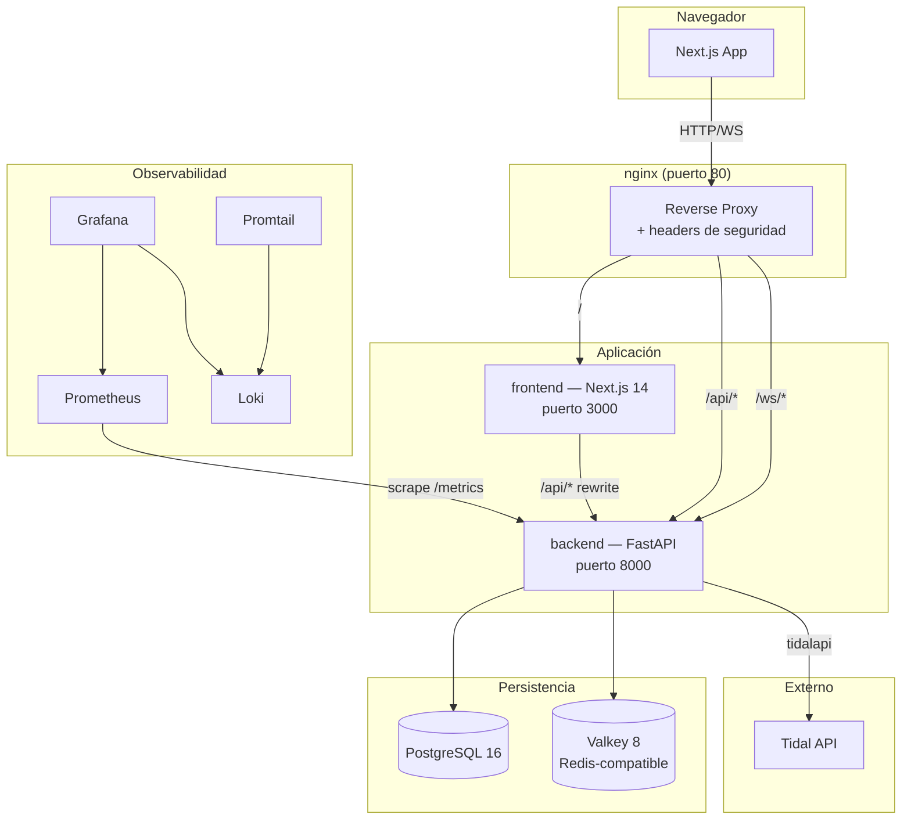
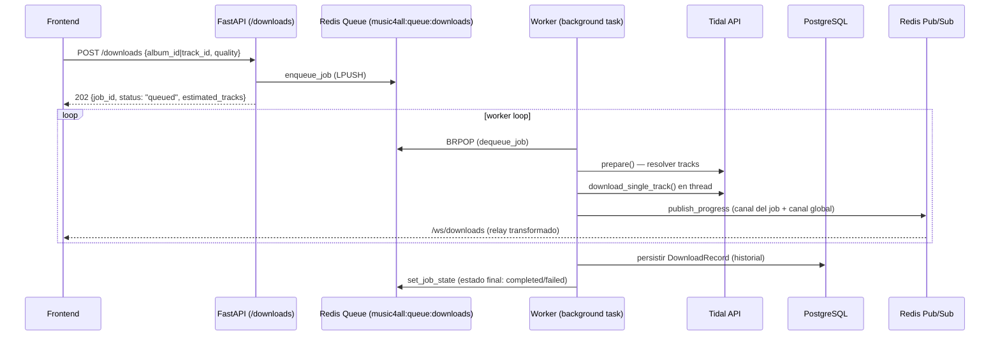
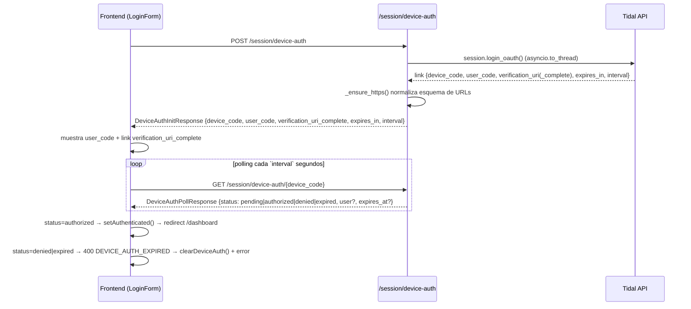

# Arquitectura — Music 4 All

Este documento describe la arquitectura real del sistema: backend, frontend, infraestructura, observabilidad, CI/CD y dependencias críticas.

---

## 1. Vista general del sistema



---

## 2. Arquitectura Backend

**Stack**: FastAPI + Python 3.11 (AsyncIO), SQLAlchemy 2.0 + Alembic, PostgreSQL (asyncpg) / SQLite (aiosqlite, solo dev local), Redis/Valkey (`redis.asyncio`), tidalapi, slowapi (rate limiting), Prometheus + OpenTelemetry. Gestor de dependencias: **uv** (`pyproject.toml` + `uv.lock`).

### 2.1 Estructura

```
backend/app/
├── main.py            # FastAPI app, lifespan, middlewares, exception handlers, routers
├── config.py          # Settings (pydantic-settings, lee .env)
├── dependencies.py    # DI: get_engine, get_authenticated_engine, get_db
├── core/              # Infraestructura transversal
│   ├── database.py        # engine SQLAlchemy async, AsyncSessionLocal
│   ├── models.py           # Base, DownloadRecord, AuditLog
│   ├── redis_client.py      # cliente Redis/Valkey + helpers (sesión, cola, pub/sub)
│   ├── tidal.py              # TidalDownloader (wrapper tidalapi)
│   ├── worker.py              # worker de descargas (consumidor de cola)
│   ├── job_controls.py        # registro de controles pause/resume/cancel por job
│   ├── reconciliation.py       # reconciliación de jobs huérfanos al arrancar
│   ├── rate_limiter.py          # slowapi limiter (storage configurado con REDIS_URL)
│   ├── metrics.py                # métricas Prometheus custom
│   ├── logging_config.py          # logging JSON estructurado
│   ├── security.py, sanitizer.py   # hardening / validación de entradas
│   └── exceptions.py               # ApiException (formato de error uniforme)
└── modules/           # Un módulo por dominio: router → service → repository → schemas
    ├── auth/      (legacy)   — /auth/*
    ├── session/   (v2)       — /session/*
    ├── search/    (v2)       — /search, /resolve, /albums/{id}
    ├── metadata/  (legacy)   — /metadata/search
    ├── download/  (legacy)   — /download/*, /ws/progress/{job_id}
    ├── jobs/      (v2)       — /downloads (POST/PATCH/DELETE)
    └── history/   (legacy)   — /history, /history/stats
```

Cada módulo sigue el mismo patrón de capas:
- **`router.py`** — endpoints FastAPI, rate limiting (`@limiter.limit(...)`), manejo de errores vía `ApiException`.
- **`service.py`** — lógica de negocio.
- **`repository.py`** — acceso a datos (tidalapi, Redis, PostgreSQL).
- **`schemas.py`** — modelos Pydantic de entrada/salida.

### 2.2 Inventario de endpoints

| Router | Prefijo | Endpoints | Estado |
|---|---|---|---|
| `auth` | `/auth` | `GET /status`, `POST /device`, `POST /logout` | Legacy |
| `session` | `/session` | `GET /status`, `POST /device-auth`, `GET /device-auth/{device_code}` | **v2 — activo (login actual)** |
| `search` | (sin prefijo) | `GET /search`, `GET /resolve`, `GET /albums/{album_id}` | v2 |
| `metadata` | `/metadata` | `GET /search` | Legacy |
| `download` | `/download` | `POST /start`, `GET /status/{job_id}`, `GET /file/{job_id}` | Legacy |
| `jobs` | `/downloads` | `POST ""`, `PATCH /{job_id}`, `DELETE /{job_id}` | **v2 — activo (dashboard actual)** |
| `history` | `/history` | `GET ""`, `GET /stats` | Legacy (única vía de historial) |
| `ws` (download) | `/ws` | `WS /progress/{job_id}` (sin auth), `WS /downloads` (con auth) | Legacy + **v2 unificado activo** |

Notas:
- El frontend actual (v2) usa: `/session/*` para login, `/search` y `/resolve` para búsqueda, `POST /downloads` (`jobs` router, body `{album_id|track_id, quality}`) para iniciar descargas, `/ws/downloads` para progreso, y `/history` (legacy, único existente) para el historial.
- Los routers legacy (`auth`, `metadata`, `download`, `/ws/progress/{job_id}`) se mantienen por compatibilidad — no eliminar sin confirmación.

### 2.3 Ciclo de vida de la aplicación (`lifespan` en `main.py`)

1. Crea tablas SQLAlchemy (`Base.metadata.create_all`) si no existen.
2. Conecta a Redis/Valkey (`app.state.redis`).
3. Intenta cargar sesión Tidal persistida desde Redis; si no existe, migra desde `session.json` (legacy) y la borra tras migrar.
4. Inicializa `TidalDownloader` (`app.state.engine`) con la sesión cargada (si hay).
5. Inicializa `pending_oauth` (legacy) y `pending_oauth_v2` (dict keyed por `device_code`) y `JobControlRegistry`.
6. **RM-09.1**: `reconcile_stale_jobs()` — marca como fallidos los jobs que quedaron "in-progress" de un proceso anterior, antes de arrancar el worker (evita "jobs zombie").
7. Lanza el worker de descargas como tarea de background (`start_worker`).
8. Al apagar: cancela el worker, cierra Redis, libera el engine de DB y limpia el directorio temporal de `TidalDownloader`.

### 2.4 Middlewares y observabilidad registrados en `main.py`

- **Rate limiting**: `slowapi` (`SlowAPIMiddleware`), límites por endpoint (ej. `5/minute` en `POST /session/device-auth`, `120/minute` en polling, `10/minute` en inicio de descarga).
- **GZip** (`GZipMiddleware`, `minimum_size=1000`).
- **CORS** (`CORSMiddleware`) — orígenes desde `settings.cors_origins` (default `http://localhost:3000`, `http://frontend:3000`).
- **Prometheus** (`prometheus_fastapi_instrumentator`) — expone `/metrics`, excluye `/metrics` y `/health` del agrupado de métricas.
- **OpenTelemetry** (`FastAPIInstrumentor`) — tracing con `ConsoleSpanExporter` (no exporta a un collector externo actualmente).
- **Exception handlers globales**: `ApiException` → `{"error": {code, message, http_status, retriable, existing_job_id?}}`; `RequestValidationError` → mismo formato con `code: "SERVER_ERROR"`, HTTP 422.
- `GET /health` — health check simple, excluido de docs/métricas.

### 2.5 Flujo de descarga (worker)



- La cola es una **lista Redis FIFO** (`music4all:queue:downloads`), procesada con `BRPOP` (timeout 2s).
- La concurrencia está limitada por `asyncio.Semaphore(settings.max_concurrent_downloads)` (default 3).
- El progreso se publica en dos canales: el canal por-job (legacy, `music4all:job:{job_id}:progress`) y el canal global `music4all:progress:all` (consumido por `/ws/downloads`).
- El estado de cada job se persiste en Redis con TTL de 24h (`music4all:job:{job_id}`, `JOB_TTL=86400`).
- Al completarse, el registro se persiste en PostgreSQL (`DownloadRecord`: title, artist, quality, cover_url, job_id, downloaded_at) — consumido por `/history`.

### 2.6 Modelo de datos (PostgreSQL, vía SQLAlchemy)

| Tabla | Columnas | Uso |
|---|---|---|
| `downloads` | `id` (UUID), `title`, `artist`, `quality`, `cover_url`, `job_id` (indexado), `downloaded_at` (indexado) | Historial de descargas (`/history`) |
| `audit_logs` | `id` (UUID), `event` (indexado), `detail` (JSON serializado), `created_at` (indexado) | Auditoría |

Migraciones gestionadas con **Alembic** (`backend/alembic/`, una migración inicial: `001_initial_tables.py`).

### 2.7 Flujo OAuth Device Authorization (Tidal)



Ver `docs/troubleshooting.md` (#3) para el detalle del fix de normalización de URLs (`_ensure_https`).

---

## 3. Arquitectura Frontend

**Stack**: Next.js 14 (App Router), React 18, TypeScript 5.5, Zustand 4.5 (con `persist`), TanStack Query 5.51, Axios, Tailwind CSS 3.4, Framer Motion 11.3, Geist Mono + Inter (`next/font`). Gestor: **pnpm**.

### 3.1 Feature-Sliced Design (FSD)

```mermaid
graph LR
    APP[app/] --> WIDGETS[widgets/]
    WIDGETS --> FEATURES[features/]
    FEATURES --> ENTITIES[entities/]
    ENTITIES --> SHARED[shared/]
    FEATURES -.expone API vía index.ts.-> WIDGETS
```

- **`app/`** — rutas de Next.js (App Router). Grupos: `(app)` (autenticado) y `(auth)` (login).
- **`widgets/`** — composiciones de página: `sidebar`, `app-header`, `player-bar`, `download-panel`.
- **`features/`** — lógica de negocio por dominio (`api/` + `model/` + `ui/`): `auth`, `search`, `downloads`, `history`, `player`, `album-detail`, `settings`.
- **`entities/`** — tipos de dominio puro: `album`, `track`, `playlist`, `download-job`, `session`.
- **`shared/`** — design system (`ui/`: Button, Card, Badge, Modal, ProgressBar, Toast, Tabs, QualitySelector, Skeleton, Input, Popover), `api/` (cliente Axios), `config/`, `hooks/`, `lib/`, `types/`.

**Código legacy (no usar)**: `src/store/useAppStore.ts`, `src/components/`, `src/hooks/`, `src/lib/` (raíz), y carpetas vacías `src/app/dashboard|history|login` (fuera de los grupos de rutas).

### 3.2 Rutas (App Router)

| Ruta | Grupo | Estado |
|---|---|---|
| `/` | — | redirect → `/dashboard` |
| `/login` | `(auth)` | Implementado — OAuth Device Flow |
| `/dashboard` | `(app)` | Implementado — búsqueda + descarga |
| `/downloads` | `(app)` | Implementado — cola de descargas |
| `/history` | `(app)` | Implementado — historial |
| `/library` | `(app)` | Placeholder (`return null`) |
| `/settings` | `(app)` | Placeholder (`return null`) |

`middleware.ts` define `PROTECTED_PATHS`/`AUTH_PATHS` y el `matcher`, pero el cuerpo no aplica redirecciones — es scaffolding para **RM-03** (cookie httpOnly de sesión). La protección actual es client-side vía rehidratación de `auth.store`.

### 3.3 Shell de aplicación — `(app)/layout.tsx`

```
┌─────────────────────────────────────────────────────────────┐
│ Sidebar (fijo izquierda, w-sidebar=240px)                     │
├─────────────┬───────────────────────────────────────────────┤
│             │ AppHeader (sticky, h-header=56px)              │
│             ├───────────────────────────────────────────────┤
│             │ <main>{children}</main> (scrollable, pb-20)    │
├─────────────┴───────────────────────────────────────────────┤
│ DownloadPanel (siempre montado — mantiene el WS vivo)        │
│ PlayerBar (fijo abajo, h-player=80px)                         │
└─────────────────────────────────────────────────────────────┘
SessionRecoveryModal — siempre presente (montado fuera del flujo)
```

El `DownloadPanel` está siempre montado para que el WebSocket (`useDownloadSocket`) permanezca vivo durante toda la sesión autenticada.

### 3.4 Estado global

| Store (Zustand) | Persistencia | Contenido |
|---|---|---|
| `features/auth/model/auth.store.ts` | `persist` → localStorage (`partialize`: solo `status`, `user`, `expiresAt`) | `status` (`authenticated\|expired\|unauthenticated`), `user`, `expiresAt`, `deviceAuth`, `isCheckingSession`, modal de recuperación |
| `features/downloads/model/downloads.store.ts` | en memoria | cola de jobs de descarga, acciones `enqueue`, `removeJob`, `clearCompleted` |
| `features/player/model` | en memoria | estado del reproductor |
| `features/settings/model` | — | ajustes |

`auth.store` **no** persiste `deviceAuth` ni tokens — `onRehydrateStorage` marca `status='expired'` si `expiresAt` ya pasó.

### 3.5 Cliente API y WebSocket

- **`shared/api/client.ts`** — instancia Axios (`baseURL=/api`, `withCredentials: true`). Interceptor de respuesta parsea el formato de error del backend (`{"error": {...}}` snake_case → `ApiError` camelCase) y, en 401 / 403 `SESSION_EXPIRED`, llama a `useAuthStore.getState().setExpired()`.
- **`shared/config/api.config.ts`** — `API_BASE_URL = NEXT_PUBLIC_API_URL ?? '/api'`, timeout 30s.
- **`shared/config/ws.config.ts`** — construye la URL de `/ws/downloads` con `ws:`/`wss:` según `window.location.protocol`.
- **`next.config.mjs`** — `rewrites()`: `/api/:path*` → `BACKEND_URL/:path*` (quita el prefijo `/api`); `/ws/:path*` → `BACKEND_URL/ws/:path*`. `images.unoptimized: true` (el proxy de imágenes de Next no puede alcanzar `resources.tidal.com` desde dentro de Docker).

### 3.6 TanStack Query

Hooks principales: `useSearchQuery`, `useResolveUrlQuery`, `useStartDownloadMutation`, `useUpdateDownloadMutation`, `useCancelDownloadMutation`, `useInitDeviceAuthMutation`, `useDeviceAuthPollingQuery` (intervalo dinámico desde `interval` del backend).

---

## 4. Arquitectura DevOps

### 4.1 `docker-compose.yml` — servicios

| Servicio | Imagen / build | Puerto host | Notas |
|---|---|---|---|
| `postgres` | `postgres:16-alpine` | 5432 | healthcheck `pg_isready` |
| `valkey` | `valkey/valkey:8-alpine` | 6379 | reemplaza a `redis:7-alpine` (ver troubleshooting #5); `appendonly yes` |
| `backend` | `./backend/Dockerfile`, target `development` | 8000 | bind-mount `./backend:/app`, volumen nombrado `backend_venv:/app/.venv`, `UV_LINK_MODE=copy` |
| `frontend` | `./frontend/Dockerfile`, target `development` | 3000 | bind-mount `./frontend:/app`, volumen `frontend_pnpm_store:/app/node_modules` |
| `nginx` | `nginx:1.25-alpine` | 80 | proxy hacia `frontend`/`backend`, headers de seguridad |
| `prometheus` | `prom/prometheus:v2.49.0` | 9090 | retención 15d |
| `grafana` | `grafana/grafana:10.3.0` | 3001 | provisioning automático de datasources + dashboard |
| `loki` | `grafana/loki:2.9.0` | 3100 | almacenamiento de logs |
| `promtail` | `grafana/promtail:2.9.0` | — | recolecta logs de contenedores Docker → Loki |

Volúmenes nombrados: `postgres_data`, `valkey_data`, `backend_venv`, `prometheus_data`, `grafana_data`, `loki_data`, `frontend_pnpm_store`, `downloads`.

### 4.2 Dockerfiles (multi-stage)

**`backend/Dockerfile`**: `base` (Python 3.11-slim + uv + build-essential) → `deps` (`uv sync --frozen --no-dev`) → `development` (`uv sync --frozen` con dev deps + `--reload`) / `production` (`--workers 2`).

**`frontend/Dockerfile`**: `base` (node:20-alpine + pnpm) → `deps` (`pnpm install --frozen-lockfile`) → `development` (`pnpm dev`) / `builder` (`pnpm build`) → `production` (copia `.next/standalone` + `static` + `public`, `node server.js`).

### 4.3 Nginx (`infrastructure/nginx/conf.d/music4all.conf`)

- Headers de seguridad: `X-Frame-Options: DENY`, `X-Content-Type-Options: nosniff`, `Referrer-Policy: strict-origin-when-cross-origin`, `Content-Security-Policy` (permite `img-src` desde `resources.tidal.com`, `connect-src ws:/wss:`). HSTS está **comentado** (activar solo con HTTPS en producción).
- `location /api/` → `backend:8000/` (timeout de lectura 300s).
- `location /ws/` → `backend:8000/ws/` (upgrade de conexión, timeouts 3600s para conexiones largas).
- `location /health` → `backend:8000/health` (sin access log).
- `location /` → `frontend:3000` (soporta upgrade para HMR de Next.js).

---

## 5. Observabilidad

| Componente | Rol |
|---|---|
| **Prometheus** (`infrastructure/prometheus/prometheus.yml`) | Scrapea `/metrics` del backend (instrumentado con `prometheus-fastapi-instrumentator` + métricas custom en `app/core/metrics.py`: `downloads_total`, `downloads_in_progress`, `download_duration_seconds`, `tracks_downloaded_total`, `downloads_concurrency_limit`) |
| **Grafana** (`infrastructure/grafana/provisioning/`) | Datasources Prometheus + Loki provisionados automáticamente; dashboard `music4all.json` preconfigurado |
| **Loki + Promtail** | Promtail lee logs de contenedores Docker (`/var/lib/docker/containers`) y los envía a Loki; Grafana los consulta |
| **OpenTelemetry** | `FastAPIInstrumentor` + `TracerProvider` con `ConsoleSpanExporter` — trazas se imprimen a consola/logs, **no hay exportador a un collector externo configurado actualmente** |
| **Logging** | `app/core/logging_config.py` — logs JSON estructurados (nivel `DEBUG` si `settings.debug`, sino `INFO`) |

---

## 6. CI/CD — GitHub Actions (`.github/workflows/ci.yml`)

Trigger: push a `main`/`feat/**` y PRs hacia `main`.

| Job | Qué hace | Depende de |
|---|---|---|
| `lint-backend` | `uv sync --frozen`, `ruff check .`, `ruff format --check .` | — |
| `build-frontend` | `pnpm install --frozen-lockfile`, `pnpm lint`, `pnpm build` | — |
| `test-backend` | Levanta servicios `redis:7-alpine` + `postgres:16-alpine`, corre `pytest tests/ -v --tb=short` (con `|| echo` — **no bloquea el pipeline si fallan tests**) | — |
| `security-backend` | `bandit -r app/ -ll -f json` → sube `bandit-report.json` como artifact | — |
| `docker-build` | Construye imágenes `music4all-backend` (target `production`) y `music4all-frontend` (target `builder`) con cache de GHA | `lint-backend`, `build-frontend`, `security-backend` |
| `deploy` | Plantilla SSH — **comentada/inactiva** | `docker-build`, `test-backend` |

> Nota: `test-backend` usa el servicio `redis:7-alpine`, mientras que `docker-compose.yml` local usa `valkey/valkey:8-alpine`. Ambos son compatibles vía protocolo RESP, pero es una inconsistencia de nombres/imágenes entre entornos (ver `docs/roadmap.md`).

---

## 7. Dependencias críticas

| Dependencia | Por qué es crítica |
|---|---|
| **tidalapi==0.8.11** (backend) | Toda la integración con Tidal (login OAuth device flow, búsqueda, metadata, descarga) depende de esta versión fijada; cambios de API de Tidal upstream pueden romper `core/tidal.py` y los repositories de `search`/`metadata`/`download`. |
| **redis.asyncio / Valkey** | Sesión OAuth, cola de jobs (FIFO), estado de jobs (TTL 24h) y Pub/Sub de progreso — si no está disponible, no hay login, descargas ni WS. |
| **SQLAlchemy 2 + asyncpg/aiosqlite + Alembic** | Historial de descargas y auditoría; `async_database_url` traduce `postgresql://` → `postgresql+asyncpg://`. |
| **slowapi** | Rate limiting en endpoints sensibles (`/session/device-auth`: 5/min); su `storage_uri` se configura con `REDIS_URL` en `main.py`. |
| **uv / uv.lock** (backend), **pnpm / pnpm-lock.yaml** (frontend) | Reproducibilidad de builds — Dockerfiles usan `--frozen`. |
| **Zustand `persist`** | Persistencia de sesión en `auth.store` — define qué sobrevive a un refresh (`status`, `user`, `expiresAt`, sin tokens). |
| **TanStack Query** | Polling del Device Auth flow (`useDeviceAuthPollingQuery`, intervalo dinámico) y todo el estado de servidor del dashboard. |
| **Next.js `images.unoptimized`** | Sin esto, las carátulas de álbum (`resources.tidal.com`) no cargan dentro de Docker. |
